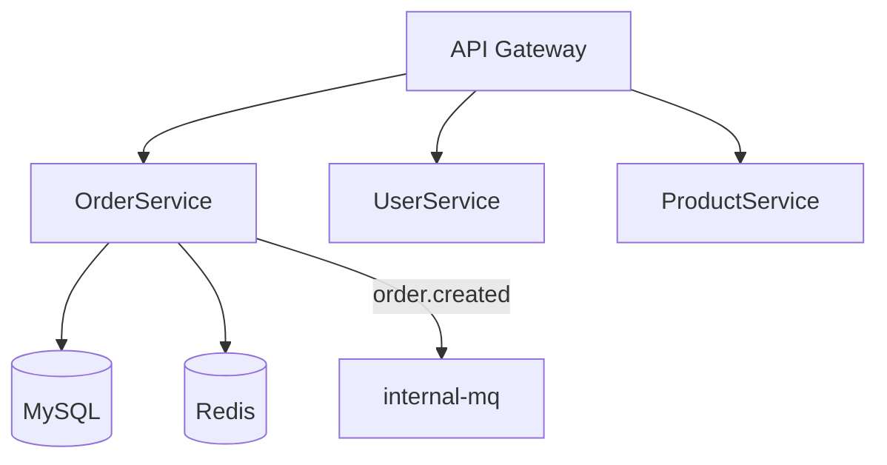

# 13. 记忆与进化 (v2.0)

> **核心目标：让 SDLC 系统越用越好用**  
> 每次 Pipeline 完成后自动沉淀经验，跨项目迁移知识，主动给 Subagent 喂相关上下文

---

## 一、3 层记忆架构

```
┌────────────────────────────────────────────┐
│ L1 短期：Pipeline 运行时                    │  ← 单次 Pipeline 内的 context
│   - 当前 stage / 上下游产物 / 决策          │     存内存 / meta.json
└────────────────────────────────────────────┘
                ↓ 完成时沉淀
┌────────────────────────────────────────────┐
│ L2 中期：项目知识库 doc/kb/                │  ← 单项目复用
│   - 架构/组件/规范/模式/反模式/ADR/Runbook  │     存项目内
│   - 每完成一次 Pipeline → 自动增量更新     │     人类 + AI 共写
└────────────────────────────────────────────┘
                ↓ 跨项目抽象
┌────────────────────────────────────────────┐
│ L3 长期：全局知识库 ~/.sdlc/kb/             │  ← 跨项目 + 跨团队
│   - 通用模式/反模式库                       │     所有用户共享（可选）
│   - 行业/技术栈最佳实践                      │     加密 + 权限分级
│   - 个人/团队偏好                            │
└────────────────────────────────────────────┘
```

---

## 二、L1 短期记忆（Pipeline 内）

### 2.1 存储位置
- **内存**：当前 Stage Runner 进程
- **持久化**：`prd/feat-xxx/meta.json` + `prd/feat-xxx/audit.log`

### 2.2 内容
```yaml
# meta.json（已在 08 文档中定义，此处仅补充 L1 视角）
context:
  current_stage: s-impl
  upstream_stages: [s-clarify, s-design]
  downstream_stages: [s-unit, s-cr, ...]
  decisions_in_flight: [...]
  recently_used_skills: [DongLog, DongDAL, MultiSkillCoordination]
  recently_used_mcp: [dongboot_analyzer, dongboothotserver]
  open_questions: [...]
  rollback_points: [...]    # 若某 stage 失败可回滚到的快照
```

### 2.3 生命周期
- Stage 启动时注入
- Stage 执行中追加
- Stage 完成后部分字段下沉到 L2
- Pipeline 完成后部分字段下沉到 L3

---

## 三、L2 中期记忆：项目知识库（doc/kb/）

### 3.1 目录结构

```
<project_root>/
  doc/
    kb/                              ← 项目知识库
      README.md                      ← KB 索引（自动维护）
      index.json                     ← 机器可读索引
      architecture.md                ← 项目架构图（文本）
      components.md                  ← 已用组件清单
      conventions.md                 ← 编码/命名/错误码/日志规范（软规范）
      patterns.md                    ← 项目内常用模式
      antipatterns.md                ← 项目内反模式（不要这么做）
      glossary.md                    ← 业务术语表
      decisions/                     ← ADR 集合
        0001-use-dongboot.md
        0002-order-id-generation.md
        ...
      runbook/                       ← 运维手册
        order-service-restart.md
        oom-investigation.md
        ...
      lessons-learned.md             ← 经验总结（自动+人工）
      evolution-log.md               ← 知识库自身的变更记录
      rules/                         ← v2.2 新增：结构化强约束规则库
        README.md                    ← 规则说明 + RFC2119 关键字
        MUST.yaml                    ← 强制（违反即失败）
        SHOULD.yaml                  ← 推荐（违反需说明）
        MAY.yaml                     ← 可选
        custom/                      ← 团队自定义
          security.yaml
          performance.yaml
        enforcer.yaml                 ← 强制器配置（CR/lint/CI 触发）
      standards/                     ← v2.2 新增：开发规范（流程级）
        README.md
        coding-style.md              ← 代码风格（含工具配置参考）
        git-workflow.md              ← 分支策略、commit 规范、PR 流程
        review-process.md            ← CR 流程、SLA、要求
        testing.md                   ← TDD/覆盖率/E2E 规范
        security.md                  ← 安全开发规范
        release.md                   ← 发布流程
        oncall.md                    ← 值班/响应规范
      architecture/                  ← v2.2 新增：架构知识库（结构化）
        README.md
        context-map.md               ← Bounded Context / 服务边界
        component-catalog.md         ← 组件全清单
        dependency-graph.md          ← 服务/组件依赖图（Mermaid）
        data-flow.md                 ← 关键链路数据流
        tech-radar.md                ← 技术选型矩阵（adopt/trial/hold）
        api-style.md                 ← API 设计规范（REST/gRPC/事件）
        schema-evolution.md          ← DB/事件 Schema 演进规则
        non-functional.md            ← 性能/可用性/一致性目标
        threats.md                   ← STRIDE 威胁模型
      cache/                         ← 派生缓存
        repo-fingerprint.json        ← 仓库指纹（用于检测变更）
        component-graph.json
        dependency-graph.json
        rule-fingerprint.json        ← v2.2：规则库指纹（用于漂移检测）
```

### 3.2 各文件内容

#### `README.md`（自动维护）
```markdown
# 项目知识库

> 由 SDLC 系统自动维护，**禁止手工编辑**（除非必要）  
> 任何修改都会记录到 `evolution-log.md`

## 快速索引

| 文件 | 用途 | 更新频率 |
|------|------|----------|
| [architecture.md](architecture.md) | 架构图与子系统划分 | 每月 |
| [components.md](components.md) | 组件/中间件清单 | 每周 |
| [conventions.md](conventions.md) | 编码规范 | 季度 |
| [patterns.md](patterns.md) | 常用模式 | 每周 |
| [antipatterns.md](antipatterns.md) | 反模式 | 实时 |
| [decisions/](decisions/) | 架构决策记录 | 每次 ADR |
| [runbook/](runbook/) | 运维手册 | 事件驱动 |
| [lessons-learned.md](lessons-learned.md) | 经验总结 | 每月 |

## 最近更新

- 2026-06-05 14:30 - [components.md] 新增「DongSchedule」批量任务
- 2026-06-05 11:00 - [architecture.md] 订单服务架构调整
- 2026-06-04 18:20 - [decisions/0005.md] 新 ADR：缓存一致性策略
- ...

## 统计

- 共 12 个文档
- 8 个 ADR
- 15 个 runbook
- 5 个 lessons-learned
- 最近一次 init: 2026-05-01
- 最近一次更新: 2026-06-05
```

#### `architecture.md`（自动）
```markdown
# 项目架构

> 自动生成于 2026-06-05，基于 12 次 Pipeline 运行 + 源码扫描

## 子系统



## 关键流程

### 下单流程
1. Gateway 鉴权
2. OrderService 校验库存（ProductService）
3. OrderService 写库（MySQL）
4. OrderService 失效缓存（Redis）
5. 发送 internal-mq 消息（order.created）
6. 返回订单号

（自动从代码 + Pipeline 产物反推）
```

#### `components.md`（自动）
```markdown
# 组件清单

| 组件 | 版本 | 用途 | 引入日期 | 用法示例 |
|------|------|------|----------|----------|
| DongBoot | 2.5.0 | 父框架 | 2026-01-15 | 全部 |
| DongLog | 1.2.0 | 业务日志 | 2026-01-15 | OrderService, UserService |
| DongDAL | 3.0.0 | 数据访问 | 2026-01-15 | OrderRepository, UserRepository |
| DongCache | 1.5.0 | 本地缓存 | 2026-02-10 | ProductCache |
| DongLock | 1.0.0 | 分布式锁 | 2026-03-01 | OrderCreateLock |
| DongSequence | 1.0.0 | 序列号 | 2026-04-05 | OrderIdGenerator |
| DongSchedule | 1.0.0 | 定时任务 | 2026-06-05 | OrderExportJob |
| internal-rpc | - | RPC | 2026-01-15 | ProductServiceClient |
| internal-mq | - | 消息 | 2026-01-15 | OrderEventPublisher |

## 即将引入

- DongHttp：下一迭代评估
```

#### `conventions.md`（自动 + 人工确认）
```markdown
# 项目规范

## 命名

- 类名：PascalCase，`OrderService`、`UserController`
- 方法名：camelCase，`createOrder`、`getUserById`
- 常量：UPPER_SNAKE_CASE，`MAX_RETRY_COUNT`
- 包名：小写，层级不超过 4 层

## 错误处理

- 业务错误：抛 `BusinessException` + 错误码
- 系统错误：抛 `SystemException`
- 所有错误必须经过 `GlobalExceptionHandler`
- **禁止**返回 null（用 Optional 或 Result 包装）

## 日志

- 用 `BizLogger`（DongLog）
- 入口：INFO 含 input 参数
- 出口：INFO 含 output 摘要
- 异常：ERROR 含 stack trace + context
- 必带字段：userId, orderId, traceId

## 数据库

- 表名：snake_case + 业务前缀，`t_order`、`t_user`
- 主键：bigint auto_increment
- 时间字段：created_at / updated_at / deleted_at
- 软删：deleted_at IS NULL
```

#### `patterns.md`（自动）
```markdown
# 项目模式

## 模式 1：下单幂等

**场景**：用户可能多次点击提交  
**方案**：用 `idempotency_key` 唯一索引 + 服务层去重  
**代码**：`OrderService.createWithIdempotency()`  
**覆盖**：`OrderController` / `OrderService` / `OrderRepository`  
**首次发现**：feat-20260603-005（bug-fix）

## 模式 2：缓存双删

**场景**：更新后缓存可能读到旧值  
**方案**：更新前删 → 更新 DB → 延迟 500ms 再删  
**代码**：`ProductService.updateWithCache()`  
**首次发现**：feat-20260512-003
```

#### `antipatterns.md`（自动）
```markdown
# 反模式（不要这样做）

## AP-1：直接在 Controller 调 Repository

**症状**：跳过 Service 层  
**后果**：业务逻辑分散、难以测试、事务边界混乱  
**案例**：feat-20260518-001 (cr 拒绝)  
**修复**：所有 DB 操作必须在 Service

## AP-2：用 System.out.println 调试

**症状**：出现 `System.out.println(...)`  
**后果**：无日志级别、无格式、无法追踪  
**案例**：feat-20260520-002 (cr 拒绝)  
**修复**：用 `BizLogger.info(...)` 或 `log.info(...)`

## AP-3：循环里调 RPC

**症状**：`for (item : list) { remoteService.call(item); }`  
**后果**：性能灾难  
**案例**：feat-20260525-004 (线上事故)  
**修复**：批量接口 `batchQuery` 或 `CompletableFuture` 并行

## AP-4：未捕获的 RuntimeException

**症状**：catch (Exception) 但只 log 不 rethrow  
**案例**：feat-20260601-002  
**修复**：明确处理或向上抛，GlobalExceptionHandler 兜底
```

#### `decisions/0001-use-dongboot.md`（人工+自动）
```markdown
# ADR-0001: 使用 DongBoot 作为基础框架

## 状态
已接受（2026-01-10）

## 背景
新项目启动，需要选型基础框架。备选：
- Spring Boot 3 + 自建组件
- DongBoot 2.5（含 dong 系列组件）
- Spring Cloud Alibaba

## 决策
使用 DongBoot 2.5。

## 理由
- 与公司中间件体系深度集成（dong-cache / dong-thread 等）
- 已有 5+ 项目验证过
- 内部 SLA 保障
- 监控/告警/全链路追踪开箱即用

## 后果
- 团队需要熟悉 DongBoot
- 锁定到公司中间件
- 享受 dong 系列组件红利
```

#### `runbook/order-service-restart.md`（事件驱动）
```markdown
# OrderService 重启

## 触发条件
- 内存使用 > 80%
- OOM 告警
- 代码热部署失败

## 操作步骤
1. 通知 oncall 群
2. 拉新版本：`kubectl rollout restart deployment/order-service`
3. 观察 5min：日志 / QPS / 错误率
4. 恢复后写 incident 报告

## 回滚
- 上一版本：`kubectl rollout undo deployment/order-service`
- 5min 内恢复

## 联系人
- oncall：见 #sre-oncall
- OrderService owner：@张三
```

#### `lessons-learned.md`（每月汇总）
```markdown
# 经验总结

## 2026-06

### 1. 幂等键必须加 DB 唯一索引
- 来源：feat-20260603-005 (bug-fix)
- 教训：只在代码层检查不够，高并发下会穿透
- 行动：所有写接口必须 DB 唯一约束

### 2. 批量 RPC 必用批量接口
- 来源：feat-20260525-004 (线上事故)
- 教训：循环调 RPC 是性能陷阱
- 行动：所有下游必须提供 batch 接口

## 2026-05
...
```

#### `index.json`（机器可读）
```json
{
  "schema_version": "2.0",
  "project_id": "order-service",
  "last_init": "2026-05-01T10:00:00Z",
  "last_update": "2026-06-05T14:30:00Z",
  "total_pipelines": 12,
  "files": {
    "architecture.md": {"hash": "sha256:abc...", "updated_at": "2026-06-05T11:00:00Z", "auto": true},
    "components.md": {"hash": "sha256:def...", "updated_at": "2026-06-05T14:30:00Z", "auto": true},
    ...
  },
  "stats": {
    "components_count": 9,
    "adrs_count": 8,
    "runbooks_count": 15,
    "lessons_count": 5,
    "patterns_count": 12,
    "antipatterns_count": 8
  }
}
```

### 3.3 增量更新机制

每次 Pipeline 完成，按规则增量更新：

| Stage 完成 | 更新文件 | 更新方式 |
|------------|----------|----------|
| **s-clarify** | conventions.md, glossary.md | 提取新术语/规范 |
| **s-design** | architecture.md, decisions/ | 新 ADR 入库 |
| **s-impl** | components.md, patterns.md, antipatterns.md | 新组件/新模式/新反模式 |
| **s-cr** | antipatterns.md | CR 拒绝的问题入反模式库 |
| **s-test** | patterns.md, antipatterns.md | 测试反模式 |
| **s-deploy** | runbook/ | 新增/更新 runbook |
| **s-mon** | runbook/, components.md | 监控项入 components |
| **hotfix** | lessons-learned.md, antipatterns.md | 立即总结 |
| **incident** | lessons-learned.md | 5 Whys 模板 |

### 3.4 KB 写入 API（Stage 后置钩子）

```python
# ~/.sdlc/hooks/post_stage.py
def on_stage_complete(stage, outputs):
    if stage == "implement-backend":
        kb = KnowledgeBase()
        kb.update_components(extract_new_components(outputs["code"]))
        kb.update_patterns(extract_patterns(outputs["code"]))
        kb.update_antipatterns(extract_antipatterns(outputs["code"]))
    elif stage == "cr":
        kb = KnowledgeBase()
        kb.update_antipatterns(extract_rejected_items(outputs["review_report"]))
    elif stage == "deploy":
        kb = KnowledgeBase()
        kb.update_runbook(extract_runbook(outputs["deploy_record"]))
    ...
```

---

## 四、L3 长期记忆：全局知识库（~/.sdlc/kb/）

### 4.1 目录结构

```
~/.sdlc/kb/
  global/                          ← 全局共享
    patterns/                      ← 通用模式
      idempotency.md
      cache-aside.md
      saga.md
      ...
    antipatterns/                  ← 通用反模式
      god-object.md
      spaghetti-code.md
      magic-numbers.md
      ...
    best-practices/                ← 最佳实践
      java-dongboot.md
      python-flask.md
      frontend-react.md
      ...
    failures/                      ← 失败案例库
      2026-q2-incidents.md
      ...
  team/                            ← 团队共享
    conventions.md
    glossary.md
    components-preferred.md
  personal/                        ← 个人偏好
    style.md
    shortcuts.md
  cross-project/                   ← 跨项目抽象
    migration-checks.md
    refactor-checklist.md
```

### 4.2 知识获取方式

| 方式 | 说明 | 何时 |
|------|------|------|
| **自动提取** | AI 从历史 Pipeline 反推 | 每月 |
| **手动沉淀** | 用户主动写 KB 文件 | 任意 |
| **社区导入** | 导入开源/团队 KB | 初始化 |
| **跨项目迁移** | 从 A 项目抽到 L3，B 项目用 | 跨项目抽象 |

### 4.3 知识使用方式

在 Stage 启动时，按相关性自动注入：

```python
def on_stage_start(stage, project_kb):
    # 1. 加载项目 KB
    project_context = project_kb.read_all()
    
    # 2. 加载相关全局 KB
    global_patterns = global_kb.search(stage.tags)  # 标签匹配
    
    # 3. 加载团队 KB
    team_conventions = team_kb.read_all()
    
    # 4. 注入到 Subagent prompt
    subagent.inject_context({
        "project": project_context,
        "patterns": global_patterns,
        "conventions": team_conventions
    })
```

### 4.4 知识衰减与清理

- 90 天无用的 patterns → 标记为 stale
- 1 年无用的 → 归档
- 错误率高（误报）的 antipatterns → 下线
- 每月生成 `kb-health-report.md`

---

## 五、进化机制：越用越好用

### 5.1 进化指标

```yaml
evolution_metrics:
  - first_pass_success_rate          # 一次通过率
  - cr_rejection_rate_per_category   # CR 拒绝率（按类别）
  - kb_completeness_score            # KB 完整度
  - pattern_reuse_rate               # 模式复用率
  - antipattern_incidence_rate       # 反模式出现率
  - mean_pipeline_time_trend         # 平均 Pipeline 耗时趋势
  - mean_pipeline_cost_trend         # 平均 Pipeline 成本趋势
```

### 5.2 进化触发器

| 触发条件 | 自动动作 |
|----------|----------|
| CR 拒绝某类问题 ≥ 3 次 | 写 antipattern + 强制 CR 检查 |
| 同一模式实现 ≥ 3 次 | 抽象为 pattern + 模板化 |
| Pipeline 失败 ≥ 2 次同一根因 | 写 lessons-learned + 防御代码 |
| 新组件引入 | 写 components.md + 最佳实践 |
| 线上事故 ≥ 1 次 | 写 postmortem + lessons-learned + 防御监控 |
| 用户手动 mark 「好」/「差」 | 更新评分，影响未来 Subagent 选型 |

### 5.3 主动学习

每次 Pipeline 完成后，AI 自问：
1. **有没有反模式可以写？**（基于 CR/Test 失败）
2. **有没有模式可以抽象？**（基于代码相似度）
3. **有没有 ADR 应该记？**（基于新设计决策）
4. **有没有 runbook 缺失？**（基于 deploy/operate）
5. **有没有 lessons 可总结？**（基于 hotfix/incident）

### 5.4 Subagent 自适应

Subagent 越用越准：

```yaml
# ~/.sdlc/agents/learned/coder-backend.yaml
coder-backend:
  base_model: sonnet
  learned_preferences:
    style: "concise, prefer stream API"
    test_style: "junit5 + AssertJ + DongMock"
    log_style: "BizLogger + 7 字段"
  known_mistakes:
    - "forbid: System.out.println"
    - "forbid: catch(Exception) without rethrow"
  preferred_patterns:
    - "Result<T> wrapper"
    - "Optional<T> for nullable"
  cost_per_task: 0.32  # 实际学习到的平均值
  success_rate: 0.87   # 实际成功率
```

---

## 六、KB 初始化（sdlc init）

详见 `14-init-and-bootstrap.md`。  
简述：

```bash
sdlc init
  → 扫描项目
  → 识别技术栈 / 组件 / 规范
  → 生成 KB 骨架
  → 推荐 Profile/Adapter
  → 输出 onboarding 报告
```

---

## 七、上下文更新：每 stage 必更新

详见下方「7.1 强约束」。

### 7.1 强约束（v2.0 新增）

**任何 stage 完成后，必须做以下 1-3 项**：

1. **更新项目 KB**（按上表规则）
2. **更新 meta.json 中 `context_updates` 字段**
3. **写 audit.log 记录更新内容**

### 7.2 自动化

```yaml
# 在 stage_runner.yaml 中
post_actions:
  - kind: kb_update
    spec:
      trigger: always
      operations:
        - update_components_if_new
        - update_patterns_if_new
        - update_antipatterns_if_new
        - update_runbook_if_new
    required: true
    on_failure: warn
```

### 7.3 反模式：KB 脱节

症状：
- Pipeline 跑完 1 周后 KB 没有任何更新
- doc/kb/ 一直是 init 时那一份

防御：
- 每周一 09:00 自动 `sdlc kb reconcile`
- 比对 pipeline history vs KB evolution log
- 不一致 → 触发 AI 重写

---

## 八、KB 安全与权限

```yaml
# ~/.sdlc/kb/permissions.yaml
permissions:
  read:
    - all_users
  write:
    auto_generated: sdlc_system
    manual_edit: project_owner  # 需项目 owner 权限
  share:
    team_kb: team_lead
    global_kb: kb_admin
  redact:
    - secrets
    - credentials
    - personal_data
```

---

## 九、KB 评估（每季度）

```yaml
quarterly_kb_health_check:
  coverage:
    - 所有服务有 architecture.md
    - 所有 active 组件在 components.md
    - 所有 P0 事故有 lessons-learned
  freshness:
    - 30 天内有更新
    - 90 天内有 review
  quality:
    - 无 outdated 信息
    - 链接可点
    - Mermaid 图能渲染
  usage:
    - Subagent 注入率 > 80%
    - 模式复用率 > 30%
```

---

## 十、版本

- v2.0 (2026-06-05): 3 层记忆架构 + KB 机制 + 进化机制
- v2.2 (2026-06-05): L2 KB 增 `rules/`（强约束规则）+ `standards/`（流程规范）+ `architecture/`（结构化架构知识），详见 `15-rule-and-standard-library.md`

---

## 十一、规则/规范/架构 KB 简介（v2.2 摘要）

> 完整设计见 `15-rule-and-standard-library.md`，本节只放索引。

### 11.1 三类 KB 对比

| 维度 | `conventions.md` | `rules/` | `standards/` | `architecture/` |
|---|---|---|---|---|
| 形式 | 自由 Markdown | YAML 强结构化 | Markdown + 工具配置 | Markdown + Mermaid + YAML |
| 强制级别 | 软（建议） | **硬（MUST/SHOULD/MAY）** | 流程级（团队契约） | 知识级（事实） |
| 校验方式 | 人审 | **自动（CR/lint/CI）** | 人审 + 工具检查 | 人工对照 + 自动依赖扫描 |
| 写入 | Stage post-action + 人工 | **规则管理员** | PM/TL | 架构师 + 自动扫描 |
| 例子 | "建议用 UUID 命名" | "**禁止**用 `Thread.sleep`" | "PR 必须 2 个 reviewer" | "订单服务 = 8 核 / 16G / 2 副本" |

### 11.2 rules/ 子库速览

```yaml
# doc/kb/rules/MUST.yaml（强制）
- id: NO-THREAD-SLEEP
  category: coding
  level: MUST
  pattern: "java.lang.Thread.sleep"
  message: "禁止使用 Thread.sleep；请用 DongThread 调度"
  rationale: "阻塞主线程，破坏可观测性"
  applies_to: ["**/*.java"]
  enforcer: [cr, lint]
  since: 2026-01-01

- id: REQUIRED-ERROR-CODE
  category: error-handling
  level: MUST
  pattern: "throw new BizException\\(\\d+\\)"
  message: "业务异常必须带 6 位错误码"
  enforcer: [cr]
  since: 2026-01-01
```

### 11.3 standards/ 子库速览

```markdown
# doc/kb/standards/coding-style.md
## 命名
- 类名 PascalCase，方法名 camelCase，常量 UPPER_SNAKE
- 包名全小写，禁止下划线
## 注释
- 所有 public 方法必须有 Javadoc
- 复杂逻辑必须含示例代码
## 工具
- 格式化：google-java-format
- 静态检查：SpotBugs + PMD + Checkstyle
```

### 11.4 architecture/ 子库速览

```markdown
# doc/kb/architecture/component-catalog.md
| 服务 | 职责 | 技术栈 | 副本数 | 关键依赖 |
|---|---|---|---|---|
| order-service | 下单 | DongBoot 2.1 | 2 | mysql-order, jimdb-cart |
| payment-service | 支付 | DongBoot 2.1 | 3 | internal-mq-pay, mysql-pay |
```

### 11.5 与 Subagent / Stage 联动

| 阶段 | 自动加载的 KB |
|---|---|
| `implement-*` | `rules/MUST.yaml` + `rules/SHOULD.yaml` + `architecture/component-catalog.md` + `standards/coding-style.md` |
| `cr` | 全部 MUST 规则 + 当前 PR 涉及组件的架构文档 |
| `security-scan` | `rules/custom/security.yaml` + `architecture/threats.md` |
| `deploy` | `standards/release.md` + `architecture/non-functional.md` |
| `monitor-setup` | `architecture/component-catalog.md` + `architecture/non-functional.md` |

### 11.6 与 Adapter 联动

Adapter 配置新增：

```yaml
adapters:
  dongboot:
    enforce_rules: true           # 启用规则强制
    rule_sets:
      - doc/kb/rules/MUST.yaml
      - doc/kb/rules/custom/security.yaml
    rule_overrides:
      - id: NO-THREAD-SLEEP
        enabled: false            # 临时关闭
        reason: "P0 紧急修复 TL001"
        expires_at: 2026-07-01
```
