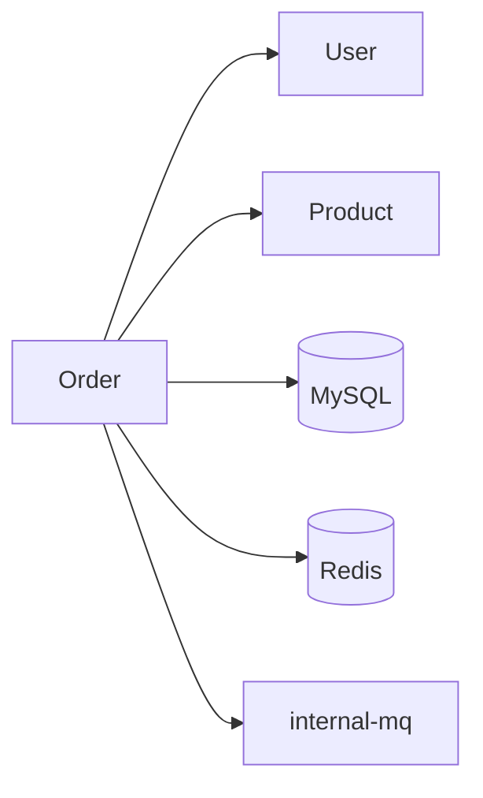

# 14. 项目初始化与引导 (v2.0)

> **核心：`sdlc init` 一行命令让 SDLC 系统读懂你的项目**  
> 自动扫描 → 识别 → 推荐 → 生成 KB → 准备就绪

---

## 一、`sdlc init` 命令

### 1.1 用法

```bash
# 在项目根目录
cd /path/to/your-project
sdlc init

# 指定配置
sdlc init --team=team-alpha --profile=strict

# 强制重新初始化（覆盖现有 KB）
sdlc init --force

# 只扫描不写入（dry-run）
sdlc init --dry-run

# 从模板初始化（团队模板）
sdlc init --template=team-java-dongboot
```

### 1.2 输出

```
🔍 扫描项目...
  ✓ 识别技术栈: Java + DongBoot 2.5.0
  ✓ 识别组件: 12 个 dong 系列 + internal-rpc + internal-mq
  ✓ 识别包结构: com.jd.order (主) + com.jd.user + com.jd.product
  ✓ 识别测试框架: JUnit5 + DongMock
  ✓ 识别构建工具: Maven 3.9
  ✓ 识别代码量: ~15,000 行 / 85 个 Java 文件

📊 生成项目画像...
  ✓ 复杂度: 中大型
  ✓ 团队规模: ~10 人
  ✓ 业务领域: 电商订单
  ✓ 推荐 Adapter: dongboot
  ✓ 推荐 Profile: new-feature / bug-fix / hotfix

📚 初始化 KB...
  ✓ doc/kb/README.md
  ✓ doc/kb/architecture.md
  ✓ doc/kb/components.md (12 组件)
  ✓ doc/kb/conventions.md (从现有代码反推)
  ✓ doc/kb/patterns.md (从代码抽象)
  ✓ doc/kb/antipatterns.md (从 lint/cr 历史)
  ✓ doc/kb/glossary.md (从注释/命名)
  ✓ doc/kb/decisions/ (导入已有 ADR)
  ✓ doc/kb/runbook/ (导入 SRE wiki)
  ✓ doc/kb/lessons-learned.md
  ✓ doc/kb/index.json

📦 配置 Adapter...
  ✓ ~/.sdlc/projects/order-service/adapter.yaml

🎯 准备就绪！可执行:
   sdlc run "..."          # 跑需求
   sdlc status             # 查看状态
   sdlc kb show            # 查看 KB
   sdlc kb edit            # 手动编辑
   sdlc kb sync            # 同步 KB
```

### 1.3 初始化报告

```yaml
# doc/kb/init-report.md（首次 init 后生成）
init_report:
  timestamp: 2026-06-05T14:30:00Z
  duration_seconds: 45
  project:
    path: /Users/me/projects/order-service
    git_remote: git@git.jd.com:order/order-service.git
    git_branch: main
    git_commit: abc123...
  detected:
    languages: [java]
    frameworks: [dongboot-2.5, spring-context]
    components: 12
    build_tool: maven
    test_framework: junit5
    code_stats:
      total_files: 85
      total_lines: 15000
      test_coverage: 67%
  recommended:
    adapter: dongboot
    primary_profile: new-feature
    secondary_profiles: [bug-fix, hotfix, refactor]
    common_stages: [s-clarify, s-design, s-impl, s-unit, s-cr, s-pkg, s-deploy, s-mon]
  kb_created:
    files: 11
    adrs_imported: 5
    runbooks_imported: 12
  warnings:
    - "测试覆盖率 67% < 推荐 80%"
    - "未找到 CLAUDE.md / AGENTS.md"
  next_steps:
    - "补充 CLAUDE.md 说明团队规范"
    - "运行 sdlc test-coverage 提升到 80%"
```

---

## 二、扫描流程

### 2.1 阶段划分

```
sdlc init
  ├─ 1. 基础扫描（10s）
  │   ├─ 文件类型统计
  │   ├─ Git 信息
  │   ├─ README/LICENSE
  │   └─ 顶层目录结构
  │
  ├─ 2. 技术栈检测（20s）
  │   ├─ package.json / pom.xml / build.gradle / requirements.txt / go.mod
  │   ├─ 锁文件（package-lock.json / poetry.lock）
  │   ├─ 框架特征（spring、django、react、gin、...）
  │   └─ 数据库/中间件特征（JDBC driver、redis client、kafka）
  │
  ├─ 3. 组件识别（30s）
  │   ├─ 已声明依赖 → 推断组件
  │   ├─ 已 import 类 → 推断使用情况
  │   ├─ 配置文件（application.yml） → 推断中间件
  │   └─ 容器化（Dockerfile / k8s yaml） → 推断部署
  │
  ├─ 4. 规范反推（30s）
  │   ├─ 命名规范（类名/方法名/包名）
  │   ├─ 错误处理（try-catch / Result / 异常）
  │   ├─ 日志风格（log4j/logback/BizLogger/print）
  │   ├─ 测试风格（junit4/5 + mockito/DongMock）
  │   └─ 注释规范（javadoc/锚点）
  │
  ├─ 5. 知识导入（30s）
  │   ├─ 已有 ADR（docs/adr/、docs/decisions/、architecture-decisions/）
  │   ├─ 已有 Runbook（docs/runbook/、wiki、sre-docs）
  │   ├─ 已有 Lessons（CHANGELOG、postmortem）
  │   └─ 已有 Glossary（glossary.md、business-terms.md）
  │
  ├─ 6. AI 深度分析（60s）
  │   ├─ Subagent kb-initializer 跑
  │   ├─ 用 LLM 反推架构图（从代码 + 包结构）
  │   ├─ 提取业务模式（重复代码 → 模式）
  │   ├─ 发现反模式（code smell）
  │   └─ 推荐 Profile + Adapter
  │
  └─ 7. 写入（10s）
      ├─ 写 doc/kb/*
      ├─ 写 ~/.sdlc/projects/<id>/config.yaml
      └─ 写 doc/kb/init-report.md
```

### 2.2 关键技术点

#### 2.2.1 指纹生成

```python
def generate_fingerprint(project_path):
    return {
        "git_sha": get_git_head(),
        "structure_hash": hash_dir_structure(project_path, max_depth=3),
        "deps_hash": hash_deps(project_path),
        "config_hash": hash_config_files(project_path),
        "kb_hash": hash_kb(project_path)
    }
```

用途：
- 检测项目变更（KB 漂移检测）
- 缓存扫描结果
- 跨项目比对

#### 2.2.2 增量更新

```bash
# 增量 init：基于上次 fingerprint 只扫描变更
sdlc init --incremental
```

#### 2.2.3 并行扫描

```python
with ThreadPoolExecutor(max_workers=4) as pool:
    f1 = pool.submit(scan_basics)
    f2 = pool.submit(scan_tech_stack)
    f3 = pool.submit(scan_components)
    f4 = pool.submit(scan_conventions)
```

---

## 三、KB 文件生成规则

### 3.1 `architecture.md`（自动）

**生成方式**：
1. 扫描包结构 → 子系统
2. 扫描 @Autowired / @Resource → 依赖关系
3. 扫描 application.yml → 中间件依赖
4. 扫描 Mermaid 文件 → 已有图
5. AI 总结 + 渲染 Mermaid

**示例**：
```markdown
# 项目架构

## 子系统
- com.jd.order (主)
- com.jd.user
- com.jd.product
- com.jd.common (工具/基础)

## 关键依赖



## 部署架构
- 8 个 Pod（K8s）
- 1 个 MySQL 主从
- 1 个 Redis Cluster（3 节点）
- 1 个 internal-mq Topic：order-events

（由 AI 从 deployment.yaml / Dockerfile / k8s yaml 反推）
```

### 3.2 `components.md`（自动）

**生成方式**：
1. 解析 pom.xml / package.json → 依赖列表
2. 过滤出 dong / 业务中间件 → 入库
3. 标注首次引入日期（从 git blame）
4. 标注当前使用情况（在哪些类/方法被用）

**示例**：见 `13-memory-and-evolution.md` 3.2。

### 3.3 `conventions.md`（自动 + 人工确认）

**生成方式**：
1. 抽样 100 个类 → 命名规范
2. 抽样 50 个方法 → 命名规范
3. 扫描 try-catch 模式 → 错误处理规范
4. 扫描 log 调用 → 日志规范
5. AI 总结 → 用户确认 → 入库

**人工确认**：
```yaml
# sdlc init 在生成 conventions.md 后会问
# 检测到的规范：
# 1. 命名：PascalCase 类、camelCase 方法（100% 符合）
# 2. 错误：90% 用 Result 包装，10% 抛异常
# 3. 日志：80% BizLogger，20% log4j
# 是否采纳为团队规范？
```

### 3.4 `patterns.md`（自动）

**生成方式**：
1. 扫描代码相似度（≥3 处重复） → 模式候选
2. AI 抽象为模式描述
3. 标注首次出现（git blame）

### 3.5 `antipatterns.md`（自动 + 持续）

**生成方式**：
1. 跑代码 lint（checkstyle / eslint / flake8）
2. 跑 SonarQube 规则
3. AI 总结历史 CR 拒绝
4. 入库

**持续更新**：CR/测试每次拒绝自动追加。

### 3.6 `glossary.md`（自动）

**生成方式**：
1. 提取注释中的业务术语
2. 提取类名/方法名中的领域词
3. 提取 README/CHANGELOG 中的关键词
4. AI 总结 → 用户确认

### 3.7 `decisions/`（导入 + 新增）

**生成方式**：
1. 扫描 `docs/adr/`、`docs/decisions/`、`docs/architecture/decisions/`
2. 用 MADR 模板标准化
3. 导入到 `doc/kb/decisions/`

**新建**：Pipeline 中 s-design stage 完成时自动创建。

### 3.8 `runbook/`（导入 + 事件驱动）

**生成方式**：
1. 扫描 `sre-docs/`、`wiki/runbook/`、`docs/operations/`
2. 标准化为统一模板
3. 导入

**新建**：Pipeline 中 s-deploy 或 s-mon 完成时自动创建。

### 3.9 `lessons-learned.md`（持续 + 每月汇总）

**生成方式**：
1. 扫描 CHANGELOG、git log、postmortem
2. AI 提取经验
3. 按月归档

**新建**：每次 hotfix / incident / 月底自动追加。

---

## 四、Adapter 配置生成

### 4.1 写入位置

```
~/.sdlc/projects/<project-id>/
  config.yaml             # 项目级配置
  adapter.yaml            # 选中的 adapter 配置
  overrides.yaml          # 用户自定义覆盖
  state/
    kb-fingerprint.json   # 指纹
    last-init: 2026-06-05
```

### 4.2 `config.yaml` 示例

```yaml
# ~/.sdlc/projects/order-service/config.yaml
project:
  id: order-service
  name: 订单服务
  path: /Users/me/projects/order-service
  git_remote: git@git.jd.com:order/order-service.git
  team: team-alpha

adapter:
  primary: dongboot
  version: 2.5.0
  enabled_components:
    - DongLog
    - DongDAL
    - DongCache
    - DongLock
    - DongSequence
    - DongSchedule
    - DongThread
    - internal-rpc
    - internal-mq
  enabled_skills:
    - DongLog
    - DongDAL
    - DongCache
    - DongLock
    - DongSequence
    - DongSchedule
    - DongThread
    - internal-rpc
    - internal-mq
    - MultiSkillCoordination
    - UnitTest
    - R2UnitTestV2
    - AutoRegression
    - DongMonitorDashboard
    - DongBootHotswapTroubleshoot
    - DeployBizLogTroubleshoot
  mcp_tools:
    - dongboot_analyzer
    - dongboothotserver
    - recommend_dongboot_version
    - internal-rpctimeout

profiles:
  primary: new-feature
  enabled: [new-feature, bug-fix, hotfix, refactor, migration]
  disabled: []

kb:
  path: doc/kb
  auto_update: true
  reconcile_cron: "0 9 * * 1"  # 周一 9:00

gates:
  auto_trigger: true
  channels:
    - im
    - email
  defaults:
    gate-1: { reviewer: pm, sla_hours: 4 }
    gate-2: { reviewer: architect, sla_hours: 8 }
    gate-3: { reviewer: tl, on_severity: P1, sla_hours: 4 }
    gate-4: { reviewer: [sre, qa], sla_hours: 4 }

budget:
  default_max_minutes: 1440
  default_max_cost_usd: 5.0
```

---

## 五、模板机制

### 5.1 团队模板

```bash
# ~/.sdlc/templates/team-java-dongboot.yaml
template: team-java-dongboot
description: 团队 Java DongBoot 项目模板
version: 1.0.0
includes:
  adapter: dongboot
  profiles: [new-feature, bug-fix, hotfix, refactor]
  components: [DongLog, DongDAL, ...]
  skills: [...]
  gates: { gate-1: pm, gate-2: architect, ... }
  conventions: ...
  patterns: ...
  antipatterns: ...
```

```bash
# 新项目复用模板
sdlc init --template=team-java-dongboot
```

### 5.2 公司模板

```bash
# ~/.sdlc/templates/jd-default.yaml
template: jd-default
description: JD 内部默认模板
includes:
  adapter: dongboot
  ...
```

---

## 六、CLAUDE.md / AGENTS.md 自动生成

### 6.1 用途
- 让任何 AI Agent 打开项目就能理解项目
- 与 KB 同步

### 6.2 生成内容

```markdown
# CLAUDE.md（自动生成，禁止手工编辑）

> 由 SDLC 系统自动维护，与 doc/kb/ 同步  
> 最近更新：2026-06-05 14:30:00

## 项目概览
- **项目**：订单服务
- **团队**：team-alpha
- **栈**：Java 17 + DongBoot 2.5 + MySQL + Redis + internal-mq

## 必读
1. [doc/kb/architecture.md](doc/kb/architecture.md) - 架构
2. [doc/kb/conventions.md](doc/kb/conventions.md) - 规范
3. [doc/kb/components.md](doc/kb/components.md) - 组件

## 工作约定
- 编码：必加 `@sdlc-feature/stage/requirement/adr/generated-by/timestamp` 锚点
- 错误：用 Result 包装或抛 BusinessException + 错误码
- 日志：必用 BizLogger
- 测试：junit5 + DongMock

## 反模式（禁止）
- AP-1: 不在 Controller 调 Repository
- AP-2: 不用 System.out.println
- AP-3: 不在循环里调 RPC

## SDLC 命令
```bash
sdlc run "..."           # 跑需求
sdlc status              # 状态
sdlc kb show             # KB 总览
sdlc kb edit <file>      # 编辑
sdlc kb sync             # 同步
```
```

### 6.3 同步

- 每次 KB 更新 → 自动同步 CLAUDE.md
- 每周一次 reconcile

---

## 七、增量更新

### 7.1 检测变更

```python
def detect_changes(project):
    last_fp = load_fingerprint()
    new_fp = generate_fingerprint(project)
    changes = diff(last_fp, new_fp)
    # {files_added, files_removed, deps_changed, configs_changed}
    return changes
```

### 7.2 选择性更新

```python
if changes.deps_changed:
    update_components_md()
    update_conventions_md()
if changes.structure_changed:
    update_architecture_md()
if changes.new_files:
    extract_patterns_and_antipatterns()
```

### 7.3 手动触发

```bash
# 每周一次 reconcile
sdlc kb reconcile

# 检测 KB 是否与代码脱节
sdlc kb drift-check

# 强制重写
sdlc kb rewrite components.md
```

---

## 八、init 失败与修复

### 8.1 常见失败

| 失败 | 原因 | 修复 |
|------|------|------|
| 无法识别技术栈 | 文件结构异常 | `--force-tech-stack=java-dongboot` |
| 权限不足 | doc/kb/ 不可写 | `chmod` 或换路径 |
| git 仓库不存在 | 不是 git 仓库 | `git init` 后重试 |
| KB 文件已存在 | 防止误覆盖 | `--force` 或 `--merge` |
| AI 分析超时 | 项目过大 | `--sample-size=100` |

### 8.2 修复模式

```bash
# 重新 init
sdlc init --force

# 只重建某个文件
sdlc kb rewrite architecture.md

# 从备份恢复
sdlc kb restore doc/kb.bak
```

---

## 九、CI/CD 集成

### 9.1 PR 检查

```yaml
# .github/workflows/sdlc-check.yml
on: [pull_request]
jobs:
  sdlc-drift:
    runs-on: ubuntu-latest
    steps:
      - uses: actions/checkout@v3
      - run: sdlc init --ci
      - run: sdlc kb drift-check
        # 检查 KB 是否过期
      - run: sdlc antipattern-scan
        # 检查 PR 是否引入反模式
```

### 9.2 定时同步

```yaml
# .github/workflows/sdlc-weekly.yml
on:
  schedule:
    - cron: '0 9 * * 1'  # 周一 9:00
jobs:
  sdlc-reconcile:
    runs-on: ubuntu-latest
    steps:
      - uses: actions/checkout@v3
      - run: sdlc init --incremental
      - run: |
          git add doc/kb/ CLAUDE.md
          git commit -m "chore: sdlc weekly reconcile"
          git push
```

---

## 十、版本

- v2.0 (2026-06-05): init 命令 + 完整 onboarding
