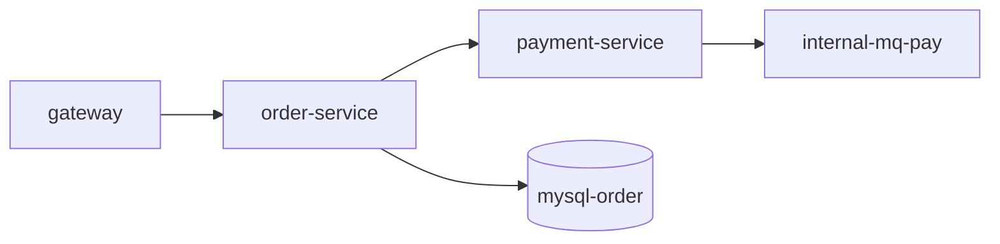

# 15. 规则 / 规范 / 架构知识库 (v2.2)

> 完整的强约束规则库 + 流程级开发规范 + 结构化架构知识库设计
> 这是 v2.1 KB（软规范 `conventions.md`）的**结构化升级**

---

## 一、设计动机

| 现状（v2.1） | 问题 | v2.2 解决 |
|---|---|---|
| `conventions.md` 纯 Markdown | Subagent 不知道"违反即失败" | 拆出 `rules/`，YAML 结构化 + RFC2119 |
| 规范写在脑里 / PR 模板 | 新成员 onboarding 慢 | 拆出 `standards/`，集中可检索 |
| 架构图在 Confluence | 改代码不改图，KB 漂移 | 拆出 `architecture/`，含 Mermaid + 依赖图 |
| 强约束无 enforcer | 只能人审，CR 不一致 | enforcer 接入 CR/lint/CI |

---

## 二、三类 KB 总览

| 维度 | `rules/` | `standards/` | `architecture/` |
|---|---|---|---|
| **目的** | 强约束（代码层 MUST/SHOULD/MAY） | 流程规范（团队契约） | 架构事实（系统是什么） |
| **形式** | YAML | Markdown + 工具配置 | Markdown + Mermaid + YAML |
| **强制级别** | 硬（违反即失败） | 中（违反需说明） | 软（事实陈述） |
| **校验** | 自动（CR/lint/CI） | 半自动（人审 + 工具） | 人工对照 + 自动扫描 |
| **写入** | 规则管理员 | PM/TL | 架构师 + 扫描器 |
| **失效条件** | 临时 override（带 expires_at） | 团队评审变更 | 架构变更即更新 |
| **例子数** | 50-200 条/项目 | 10-20 篇/团队 | 5-10 篇/项目 |

---

## 三、`rules/` 强约束规则库

### 3.1 目录结构

```
doc/kb/rules/
├── README.md                # 规则说明（RFC2119 关键字、命名规范、新增流程）
├── MUST.yaml                # 强制（违反即 CR 失败）
├── SHOULD.yaml              # 推荐（违反需在 PR 描述中说明）
├── MAY.yaml                 # 可选
├── custom/                  # 团队自定义
│   ├── security.yaml
│   ├── performance.yaml
│   ├── logging.yaml
│   └── api-style.yaml
├── enforcer.yaml            # 强制器配置（CR/lint/CI 触发器）
└── exceptions/              # 历史豁免（带过期时间）
    ├── 2026-06-legacy-thread-sleep.md
    └── ...
```

### 3.2 规则 Schema

```yaml
# MUST.yaml 中一条规则
- id: NO-THREAD-SLEEP                      # 唯一 ID（kebab-case）
  category: coding                         # 分类（coding/error-handling/security/...）
  level: MUST                              # MUST / SHOULD / MAY
  title: "禁止使用 Thread.sleep"
  description: |
    业务代码不允许使用 Thread.sleep() 阻塞主线程。
    调度需求统一走 DongThread。
  pattern: "java\\.lang\\.Thread\\.sleep"  # 静态匹配正则（可选）
  ast_query: "MethodInvocation[name='sleep']" # 静态检查查询（可选，比正则准）
  message: "禁止使用 Thread.sleep；请用 DongThread 调度"
  rationale: |
    Thread.sleep 阻塞主线程，破坏可观测性、无法超时控制、
    浪费线程资源、难统一调优。
  applies_to:                              # 适用文件
    - "**/*.java"
    - "!**/test/**/*.java"                 # 排除测试
  enforcer: [cr, lint]                     # 强制器：cr / lint / ci / runtime
  severity: P1                             # 违反严重度
  bad_example: |
    public void wait() {
      Thread.sleep(1000);  // 违反
    }
  good_example: |
    public void wait() {
      dongThreadExecutor.schedule(() -> {...}, 1, TimeUnit.SECONDS);
    }
  references:                              # 引用
    - "doc/kb/standards/coding-style.md#async"
    - "https://wiki.company/no-thread-sleep"
  since: 2026-01-01
  deprecated_after: null                   # 永久 / 软过期时间
  owner: team-backend@company.com
  auto_generated: false                    # true 表示 Subagent 从反模式自动抽象
  source:                                  # 来源
    type: manual                           # manual / pattern_extracted / antipattern_promoted
    ticket: "DEV-1234"
    date: 2026-01-01
```

### 3.3 RFC 2119 关键字

| 关键字 | 含义 | 行为 |
|---|---|---|
| **MUST** | 强制 | 违反 = CR 失败 / lint 红 |
| **MUST NOT** | 强制禁止 | 同上 |
| **SHOULD** | 强烈推荐 | 违反 = 需 PR 描述中 `## Exceptions` 章节说明原因 |
| **SHOULD NOT** | 强烈不推荐 | 同上 |
| **MAY** | 可选 | 仅记录，不强制 |
| **MAY NOT** | 不允许但可豁免 | 需架构组审批 |

### 3.4 规则分类（category）

| 分类 | 例子 | 数量参考 |
|---|---|---|
| `coding` | 命名、复杂度、注释、格式 | 20-40 |
| `error-handling` | 错误码、异常分类 | 5-10 |
| `security` | SQL 注入、XSS、CSRF、密钥 | 10-20 |
| `performance` | 禁止 N+1、缓存使用 | 5-10 |
| `logging` | 必带 traceId、不打敏感信息 | 5-10 |
| `api-style` | RESTful、错误响应、版本 | 5-10 |
| `database` | 索引、事务、分页 | 5-10 |
| `concurrency` | 线程池、锁、并发原语 | 5-10 |
| `dependency` | 禁止引入、版本锁定 | 5-10 |
| `architecture` | 包结构、依赖方向、循环依赖 | 5-10 |

### 3.5 enforcer 配置

```yaml
# enforcer.yaml
enforcers:
  cr:
    enabled: true
    subagent: reviewer
    auto_check_before_human: true     # Subagent 先扫一遍 MUST
    output_format: table              # table / json / sarif
    fail_on: [MUST, MUST_NOT]
    warn_on: [SHOULD, SHOULD_NOT]

  lint:
    enabled: true
    tools:
      - checkstyle: rules/checkstyle.xml
      - pmd: rules/pmd.xml
      - spotbugs: rules/spotbugs.xml
      - eslint: rules/.eslintrc.js      # 跨语言
    fail_on_violation: true
    ci_integration: github_actions

  ci:
    enabled: true
    stage: s-cr
    gate_on_violation: MUST
    block_merge: true

  runtime:
    enabled: false                    # 默认关闭（成本高）
    sampling_rate: 0.01               # 1% 采样
```

### 3.6 例外管理（`exceptions/`）

```
doc/kb/rules/exceptions/
├── 2026-06-legacy-thread-sleep.md
└── template.md
```

```markdown
# 例外单：legacy-thread-sleep

**规则 ID**: NO-THREAD-SLEEP
**级别**: MUST
**项目**: order-service
**申请人**: 张三
**审批人**: 李四（TL）
**生效日期**: 2026-06-01
**过期日期**: 2026-09-01（3 个月后必须重审）
**例外范围**: 
  - `src/main/java/com/old/LegacyWorker.java` 第 42-58 行
**原因**: 历史遗留代码，迁移工作量 3pd，本季度排期已满
**临时方案**: 该方法不再被新代码调用，标注 `@Deprecated(since="2026-09-01")`
**重审时间**: 2026-08-15
```

**机制**：
- 过期前 7 天告警给 TL + 申请人
- 过期未续期 → 例外失效，CR 重新失败
- 例外数 > 5 → 触发"该规则是否过时"评估

### 3.7 规则的写入与变更流程

```
需求: "禁止使用某 API"
  ↓
PM/TL 在 PR 中提出: doc/kb/rules/MUST.yaml 新增一条
  ↓
CR 审核: 必要性、粒度、是否重复
  ↓
架构组月会审批: 影响范围、是否冲突
  ↓
合入 main → 自动同步到所有 Subagent 上下文
  ↓
下次相关 stage 自动应用
```

**自动抽象**（Subagent 自学习）：
- 同一反模式在 CR 中被拒 ≥3 次 → 自动写 `MUST.yaml`
- 写入前标 `auto_generated: true`，需 PM 在 7 天内确认或撤销

---

## 四、`standards/` 流程级开发规范

### 4.1 目录结构

```
doc/kb/standards/
├── README.md                # 索引 + 适用范围
├── coding-style.md          # 代码风格
├── git-workflow.md          # 分支 / commit / PR
├── review-process.md        # CR 流程
├── testing.md               # 测试规范
├── security.md              # 安全开发
├── release.md               # 发布流程
├── oncall.md                # 值班规范
├── observability.md         # 日志/指标/追踪
└── doc.md                   # 文档规范
```

### 4.2 标准 Schema

```markdown
# coding-style.md

## 命名
- 类名 PascalCase
- 方法名 camelCase
- 常量 UPPER_SNAKE
- 包名全小写，禁下划线

## 注释
- 所有 public 方法必须有 Javadoc
- 复杂逻辑（圈复杂度 > 10）必须含示例
- 注释解释"为什么"而非"是什么"

## 工具
- 格式化：google-java-format（CI 强制）
- 静态检查：SpotBugs + PMD + Checkstyle
- 命名检查：SonarQube

## 例外
- 工具自动修复的违规不计入
- 历史代码按文件级别豁免（最长 6 个月）
```

### 4.3 与 rules/ 的区别

| 项 | rules/ | standards/ |
|---|---|---|
| 粒度 | 一行代码 / 一条 API | 整个流程 / 整个文件 |
| 形式 | YAML 单条 | Markdown 段落 |
| 强制 | 自动 | 半自动（PR 描述 + 人工） |
| 触发 | 每次提交 | 每个 PR / 每个需求 |
| 例子 | "禁用 Thread.sleep" | "PR 必须 2 reviewer" |

### 4.4 与 Stage 关联

| Stage | 必加载的 standards |
|---|---|
| `implement-*` | `coding-style.md` + `git-workflow.md` |
| `cr` | `review-process.md` |
| `unit-test` / `integration-test` / `e2e-test` | `testing.md` |
| `security-scan` | `security.md` |
| `package` / `deploy` | `release.md` |
| `monitor-setup` / `incident-response` | `oncall.md` + `observability.md` |
| `refactor` / `migration` | `coding-style.md` + `doc.md` |

---

## 五、`architecture/` 结构化架构知识库

### 5.1 目录结构

```
doc/kb/architecture/
├── README.md                # 索引
├── context-map.md           # Bounded Context / 服务边界
├── component-catalog.md     # 组件全清单（表）
├── dependency-graph.md      # 服务/组件依赖图（Mermaid）
├── data-flow.md             # 关键链路数据流
├── tech-radar.md            # 技术选型矩阵
├── api-style.md             # API 设计规范
├── schema-evolution.md      # DB/事件 Schema 演进
├── non-functional.md        # 性能/可用性/一致性目标
└── threats.md               # STRIDE 威胁模型
```

### 5.2 关键文件格式

#### `component-catalog.md`（自动 + 人工补充）

```markdown
| 服务 | 职责 | 技术栈 | 副本数 | 关键依赖 | Owner | 健康检查 |
|---|---|---|---|---|---|---|
| order-service | 下单 | DongBoot 2.1 | 2 | mysql-order, jimdb-cart | team-order | /health |
| payment-service | 支付 | DongBoot 2.1 | 3 | internal-mq-pay, mysql-pay | team-pay | /health |
```

#### `dependency-graph.md`（自动生成 Mermaid）



#### `tech-radar.md`（技术选型矩阵）

```markdown
## Adopt（默认采用）
- Java 17+
- DongBoot 2.x
- MySQL 8.0
- internal-mq 消息队列
- JIMDB 缓存

## Trial（试点）
- OpenTelemetry（50% 服务）
- gRPC（仅内部 RPC）
- Kafka（新业务试点）

## Hold（不推荐新项目使用）
- Dubbo（已退役）
- MongoDB（订单服务，禁止新项目）
- HTTP 长轮询

## 评估
- Vector DB（待评估）
```

#### `non-functional.md`（架构目标）

```markdown
| 指标 | 目标 | 测量方式 | 当前 |
|---|---|---|---|
| 可用性 | 99.95% | 季度统计 | 99.97% |
| P99 延迟 | < 200ms | 全链路追踪 | 156ms |
| 错误率 | < 0.01% | 日维度 | 0.003% |
| 容量 | 10K QPS | 压测 | 12K |
| RTO | < 5min | DR 演练 | 8min |
| RPO | < 1min | 实时同步 | 30s |
```

#### `threats.md`（STRIDE 模型）

```markdown
| 资产 | 威胁类型 | 场景 | 缓解措施 | 状态 |
|---|---|---|---|---|
| 用户密码 | Information Disclosure | DB 泄漏 | bcrypt + salt + 不打日志 | 已实施 |
| 订单状态 | Tampering | 越权修改 | ABAC + 审计日志 | 已实施 |
| 支付回调 | Repudiation | 用户否认 | internal-mq 消息存证 | 已实施 |
| API 网关 | DoS | 大量刷接口 | 限流 + 验证码 | 部分实施 |
```

### 5.3 与 Stage 关联

| Stage | 加载的 architecture/ |
|---|---|
| `impact-analysis` | `component-catalog.md` + `dependency-graph.md` |
| `design` | `context-map.md` + `tech-radar.md` + `non-functional.md` |
| `implement-*` | `component-catalog.md` + `api-style.md` |
| `cr` | `dependency-graph.md`（检测循环依赖） |
| `security-scan` | `threats.md` |
| `deploy` / `monitor-setup` | `non-functional.md` + `component-catalog.md` |
| `refactor` / `migration` | `context-map.md` + `schema-evolution.md` |

### 5.4 自动同步

| 触发器 | 写入的 architecture/ 文件 |
|---|---|
| `s-impact-analysis` 扫描出新组件 | `component-catalog.md`（追加） |
| `s-design` 完成新架构 | `context-map.md` + `tech-radar.md` |
| `s-impl` 引入新依赖 | `tech-radar.md`（trial / hold） |
| `s-deploy` 改副本数 / 资源 | `non-functional.md` + `component-catalog.md` |
| `s-mon` 改监控指标 | `non-functional.md` |
| `incident-response` P0/P1 | `threats.md` |
| 架构师手动 | 任意 |

---

## 六、与 Subagent / Stage / Adapter 的联动

### 6.1 Subagent 启动时自动注入

```yaml
subagent_context_injection:
  by_role:
    coder-backend:
      - rules/MUST.yaml
      - rules/SHOULD.yaml
      - standards/coding-style.md
      - architecture/component-catalog.md
      - architecture/dependency-graph.md
    coder-frontend:
      - rules/MUST.yaml（前端相关）
      - standards/coding-style.md（前端）
      - architecture/component-catalog.md
    reviewer:
      - rules/MUST.yaml（全部）
      - rules/SHOULD.yaml（当前 PR 涉及）
      - standards/review-process.md
      - architecture/dependency-graph.md
    security-scanner:
      - rules/custom/security.yaml
      - architecture/threats.md
      - standards/security.md
    sre-writer:
      - architecture/component-catalog.md
      - architecture/non-functional.md
      - standards/oncall.md
      - standards/observability.md
    architect:
      - architecture/（全部）
      - tech-radar.md
      - rules/MUST.yaml（架构相关）
```

### 6.2 Stage YAML 新增字段

```yaml
# 09-stage-template.md 新增
stages:
  s-impl-backend:
    pre_action:
      load_kb: [rules/MUST.yaml, standards/coding-style.md, architecture/component-catalog.md]
      enforce_rules: [MUST]
    execution:
      ...
    post_action:
      kb_update: ...
```

### 6.3 Adapter 配置新增字段

```yaml
# 05-adapters.md 新增
adapters:
  dongboot:
    enforce_rules: true
    rule_sets:
      - doc/kb/rules/MUST.yaml
      - doc/kb/rules/custom/security.yaml
      - ~/.sdlc/kb/global/dongboot-rules.yaml
    rule_overrides:                       # 临时例外
      - id: NO-THREAD-SLEEP
        enabled: false
        reason: "P0 紧急修复"
        expires_at: 2026-07-01
        approver: user:tl-zhang
```

### 6.4 CLI 新增命令

```bash
# 规则管理
sdlc rule list                          # 列所有规则
sdlc rule show <id>                     # 查看详情
sdlc rule add <file>                    # 新增规则
sdlc rule disable <id> --reason "..." --expires 2026-09-01
sdlc rule check <path>                  # 检查文件
sdlc rule violations --pr 1234          # 查看 PR 违规

# 规范管理
sdlc standard list
sdlc standard show <name>
sdlc standard lint <file>               # 检查是否符合标准

# 架构查询
sdlc arch component <name>              # 查组件
sdlc arch impact <service>              # 影响面
sdlc arch graph                         # 出依赖图
sdlc arch validate                      # 校验 KB 与代码一致性
```

---

## 七、KB 漂移防护

| 漂移类型 | 检测 | 自动修复 |
|---|---|---|
| 规则文件改了但 Subagent 未加载 | `rule-fingerprint.json` 比对 | 提示重启 |
| 组件删除但 `component-catalog.md` 还在 | CI 扫描 | 自动标 deprecated |
| 依赖加了但 `tech-radar.md` 未更新 | Subagent 编码时检测 | 强制更新 |
| 例外过期未续期 | 周一 reconcile | 通知 TL |
| 架构图与代码不一致 | `dependency-graph.json` 与 Mermaid diff | 提示更新 |

详见 `13-memory-and-evolution.md` §七。

---

## 八、版本与迁移

### 8.1 版本
- v2.2 (2026-06-05)：新增 `rules/` + `standards/` + `architecture/`，与现有 `conventions.md` 并存
- 未来 v3.0：考虑合并 `conventions.md` 进 `rules/SHOULD.yaml`

### 8.2 从 v2.1 迁移

```bash
# 自动迁移脚本
sdlc kb migrate --from=v2.1 --to=v2.2

# 动作：
# 1. 读 conventions.md，提取软规范 → rules/SHOULD.yaml
# 2. 读 architecture.md，提取结构化内容 → architecture/*.md
# 3. 读 components.md，提取组件表 → architecture/component-catalog.md
# 4. 读 patterns.md / antipatterns.md，提取硬规则 → rules/MUST.yaml
# 5. 标记每条 source 字段为 "migrated_from:conventions.md"
# 6. 人工 review（>100 条时强制）
```

### 8.3 团队落地建议

| 阶段 | 动作 |
|---|---|
| Week 1 | 把现有 `conventions.md` 拆为 `rules/SHOULD.yaml` + `standards/coding-style.md` |
| Week 2 | Subagent 接入，验证 enforcer 工作 |
| Week 3 | 收集反模式，扩充 `rules/MUST.yaml` |
| Week 4 | 架构师补全 `architecture/` 全部文件 |
| Week 5+ | 持续维护，季度评审 |

---

## 九、与其他文档的关系

| 文档 | 关系 |
|---|---|
| `13-memory-and-evolution.md` | 父文档，3 层 KB 架构；本文件是其 L2 三个子库的详细设计 |
| `05-adapters.md` | 联动，adapter 新增 `enforce_rules` 字段 |
| `09-stage-template.md` | 联动，stage 新增 `pre_action.load_kb` 字段 |
| `11-subagent-and-skills.md` | 联动，Subagent 按角色加载不同 KB |
| `02-stage-catalog.md` | 联动，stage 完成后写入对应 KB 文件 |

---

## 十、版本

- v2.2 (2026-06-05): 新增 `rules/` + `standards/` + `architecture/` 三个结构化 KB 子库
