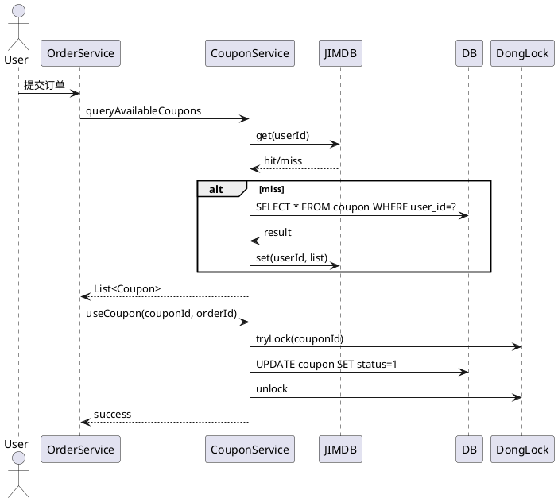

# 03 - Stage 2 架构/技术方案

## 一、目标

基于 Stage 1 的需求拆解，生成**可被工程师直接评审 + 可被 Stage 3 直接消费**的架构与设计方案。

## 二、输入

| 类型 | 来源 | 必填 |
|---|---|---|
| `01-requirements.md` | Stage 1 | 是 |
| 项目工程结构 | pom.xml / module 列表 | 是 |
| 已有架构文档 | 架构 Wiki | 否 |
| 上下游接口契约 | 接口管理平台 | 否 |
| 团队规范 | `~/.claude/rules/` | 否 |

**前置约束**：
- Stage 1 必须通过 Gate 1
- 项目工程结构必须是 DongBoot 接入状态（通过 `DongBootIntegration.check_dongboot_status` 验证）

## 三、Subagent 调度

### 3.1 派发命令

```
task(
  subagent_type: "general",
  description: "架构设计",
  prompt: "[architect prompt，见 10-subagent-spec.md §3]"
)
```

### 3.2 输入参数

```json
{
  "feature_id": "string",
  "requirements_path": "string, 01-requirements.md 的路径",
  "project_root": "string, 工程根目录",
  "constraints": {
    "must_use_dongboot": true,
    "max_coupling": "low|medium|high",
    "data_sensitivity": "low|medium|high"
  }
}
```

## 四、产物清单

输出目录：`prd/{feature_id}/02-design/`

| 文件 | 内容 | 模板 |
|---|---|---|
| `00-summary.md` | 设计总览 | 见 §4.1 |
| `01-adr/` | 架构决策记录 | MADR 模板 |
| `02-api/` | API 契约（internal-rpc/HTTP/内部） | OpenAPI/internal-rpc IDL |
| `03-db/` | 库表设计 | DDL + ER 图 |
| `04-sequence/` | 关键时序图 | PlantUML |
| `05-config.md` | 涉及配置变更 | DUCC 键清单 |
| `06-risk.md` | 风险清单 | 见 §4.6 |

### 4.1 00-summary.md 模板

```markdown
# 设计总览：{feature_id} - {feature_name}

## 1. 架构概览
{1-2 段话说明整体架构}

## 2. 模块划分
| 模块 | 职责 | 复用情况 |
|---|---|---|
| coupon-service | 券核心服务 | 全新 |
| coupon-common | 公共定义 | 复用现有 |

## 3. 关键决策
| 决策 | 选择 | 理由 |
|---|---|---|
| 存储 | MySQL + JIMDB 缓存 | QPS 10000+ |
| 分布式锁 | DongLock | 防超发 |
| 序列号 | DongSequence | 券码生成 |
| 异步 | DongThread | 过期清理 |

## 4. ADR 索引
- ADR-001: 券码生成方案
- ADR-002: 库存扣减方案
- ADR-003: 超时与重试

## 5. 影响范围
{代码/配置/上下游系统的具体清单}

## 6. 工作量估算
| 模块 | 行数估算 | 复杂度 |
|---|---|---|
| coupon-service | 1500 | 中 |
| 单测 | 800 | 中 |
```

### 4.2 ADR 模板（MADR）

```markdown
# ADR-{编号}: {标题}

## 状态
Proposed | Accepted | Deprecated | Superseded

## 背景
{什么问题、什么约束}

## 决策
{我们决定怎么做}

## 备选
### 备选 A：{名称}
- 优点
- 缺点

### 备选 B：{名称}
- 优点
- 缺点

## 后果
- 正面
- 负面
- 风险

## 实施
{具体的代码/配置改动点}
```

### 4.3 API 契约模板

```yaml
# internal-rpc 接口
- serviceName: CouponQueryService
  alias: couponQueryService
  methods:
    - name: queryAvailableCoupons
      request: QueryAvailableCouponsRequest
      response: Result<List<CouponDTO>>
      timeout: 500ms
      retries: 2

# HTTP 接口
paths:
  /api/v1/coupons:
    post:
      summary: 发放优惠券
      requestBody: ...
      responses:
        '200': { ... }
```

### 4.4 库表设计

```sql
CREATE TABLE `coupon` (
  `id` BIGINT NOT NULL AUTO_INCREMENT COMMENT '主键',
  `coupon_code` VARCHAR(32) NOT NULL COMMENT '券码',
  `user_id` BIGINT NOT NULL COMMENT '用户ID',
  `status` TINYINT NOT NULL DEFAULT 0 COMMENT '0未使用 1已使用 2已过期',
  `face_value` DECIMAL(10,2) NOT NULL COMMENT '面额',
  `expire_time` DATETIME NOT NULL COMMENT '过期时间',
  `created_time` DATETIME NOT NULL DEFAULT CURRENT_TIMESTAMP,
  PRIMARY KEY (`id`),
  UNIQUE KEY `uk_code` (`coupon_code`),
  KEY `idx_user_status` (`user_id`, `status`)
) ENGINE=InnoDB DEFAULT CHARSET=utf8mb4;
```

并附 PlantUML ER 图。

### 4.5 时序图



### 4.6 风险清单模板

| 风险 | 等级 | 缓解措施 | 负责人 |
|---|---|---|---|
| 超发 | 高 | 分布式锁 + DB 唯一索引 | AI Stage 3 关注 |
| 接口超时 | 中 | 设置合理超时 + 重试 | Stage 6 关注 |
| 缓存穿透 | 中 | 布隆过滤器 | Stage 3 实现 |

## 五、Subagent 内部工作流

```
1. Read 01-requirements.md
2. Scan project_root（pom.xml / module 列表）
3. Verify DongBoot 接入状态 → 调用 DongBootIntegration.check_dongboot_status
4. Identify 已有可复用模块（grep + read）
5. Decide 架构关键点
   - 数据存储：DB 类型、缓存策略
   - 并发控制：锁方案
   - 异步：线程池方案
   - 分布式：序列号、分布式锁
6. Draft ADR（每个关键决策一个）
7. Compose API 契约
8. Design 库表（基于 DongDAL 规范）
9. Draw 时序图
10. List 配置变更
11. Surface 风险
12. Output 到 02-design/
```

## 六、DongBoot 组件自动选型

| 场景 | 推荐组件 | Skill |
|---|---|---|
| 缓存 | DongCache | DongCache |
| HTTP 调用 | DongHttp | DongHttp |
| 分布式锁 | DongLock | DongLock |
| 序列号 | DongSequence | DongSequence |
| 定时任务 | DongSchedule | DongSchedule |
| 线程池 | DongThread | DongThread |
| 数据库 | DongDAL | DongDAL |
| ES | DongES | DongES |
| 消息队列 | internal-mq | internal-mq |
| 业务日志 | DongLog | DongLog |
| 监控盘 | DongMonitorDashboard | DongMonitorDashboard |

**强制规则**：每个组件的使用都必须在 ADR 中说明为什么不用原生方案。

## 七、Gate 2 评审规范

详见 [09-human-gates.md §2](./09-human-gates.md)。

**核心检查项**：
1. 架构是否合理（KISS 原则）
2. DongBoot 组件选型是否正确
3. 关键决策是否有 ADR 支撑
4. 影响面是否完整（上下游）
5. 风险是否被识别并缓解

**驳回典型场景**：
- 未考虑现有系统复用 → 强制要求复用
- 关键决策无 ADR → 补 ADR
- 性能边界未达 PRD 要求 → 重新设计

## 八、Subagent 工具权限

| 工具 | 权限 |
|---|---|
| read / glob / grep | ✅ |
| write | ✅（仅限 02-design/） |
| edit | ✅（仅限 02-design/） |
| bash | ⚠️ 限制：仅 `find`、`ls`、`cat`、`mvn dependency:tree` |
| 网络 | ❌ |
| git | ❌ |
| MCP（DongBoot） | ✅ 只读（如 check_dongboot_status） |

## 九、产出物归档

- 位置：`prd/{feature_id}/02-design/`
- 同时更新 `meta.json`：
  ```json
  {
    "stage": 2,
    "subagent": "architect",
    "adrs_count": 3,
    "apis_count": 5,
    "tables_count": 2,
    "risks_count": 4,
    "gate2_status": "pending|approved|rejected"
  }
  ```
