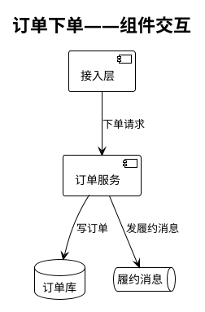
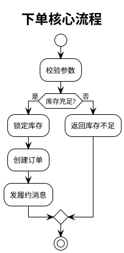

<!--
后端设计模板 —— 章节结构对齐企业 15 章标准；通用基座 + 标签化条件章节。
带 [标签] 的章节/行仅在该标签启用时保留（见 references/profiles.md）；
[enterprise-infra] 默认关闭：internal-sql-checker、存储加密、BI/数仓、internal-gateway、配送主流程、
internal-mq-client 等企业专有项默认不出现，用通用表述替代；挂载 my-enterprise overlay 时才变回完整版。
未启用的章节整段删除，不要留"不涉及"占位。产出保持干净、多图少文字。
-->

# 后端设计文档

> 需求名称：{{name}}
> 日期：{{date}}
> 状态：待评审
> 关联：{{clarify_path}}
> 项目画像：{{profile}} ｜ 启用章节：{{tags}}

---

> **绘图约定**：本文档多图少文字。所有图用 PlantUML（` ```plantuml ` 内联），
> 图内用简洁自然语言短语描述节点/动作，不放大段代码；每个图写完必须经
> plantuml-lint 校验通过（见 references/design.md 绘图规范）。
> 节点命名用中文业务名(EnglishClassName)；单图 ≤ 8 节点，复杂流程拆子图；
> 不用泳道，涉及表/外部调用在节点内标 `""表: xxx""` / `""RPC: /path""`。
> 按改动性质上色（只给本次相关逻辑上色，历史不变逻辑不上色）：
> 黄 `#FFF9C4`=核心改动 ｜ 橙 `#FDEBD0`=一般修改 ｜ 绿 `#C8E6C9`=外部调用 ｜ 白=历史逻辑。

## 〇、需求描述

{{一句话价值 + 要解决的问题 + 范围边界}}

## 一、架构设计

> 多服务交互用 PlantUML 组件图/时序图/泳道图表达。列全本次改动涉及的上下游服务及负责人。示例（按实际替换，校验后保留）：



**涉及上下游服务：**

| 服务名 | 角色（上游/下游） | 交互方式 | 负责人 |
| --- | --- | --- | --- |
|  |  |  |  |

**核心变更点：**
1.

## 二、数据库设计 `[db]`

> 数据结构图或 SQL 形式，标注新增字段/新建表/初始化 SQL。改表结构须评估生产数据量级并经 SQL review。列出 DQL/DML。
> DML 必须走主键索引；DQL 必须走索引。SQL 经语法/规范校验（sqlfluff 或团队工具）。
> `[enterprise-infra]` 时追加：经企业 internal-sql-checker 工具语法校验；评估存储加密（加密范围/长度/方案）；评估对 BI/数仓影响；枚举变更走 SOP 评估。

### 2.1 SQL 清单

| 序号 | 类型(DDL/DML/DQL) | SQL | 涉及表 | 期望索引 | 敏感字段加密 | 已找全引用 |
| --- | --- | --- | --- | --- | --- | --- |
|  |  |  |  |  |  |  |

### 2.2 数据库 Checklist

| 检查项 | 结论 |
| --- | --- |
| 是否涉及数据库变更（否则本章无需填写） |  |
| 当前数据量级（0-10万/10-100万/100-1000万/1000万以上） |  |
| 半年后预估量级 |  |
| 是否表结构不兼容变更 |  |
| 是否涉及历史数据影响 |  |
| 是否涉及数据迁移 |  |
| DQL/DML 已 review、索引使用已评估 |  |
| 已找全对表/库的引用 |  |
| 已评估对 BI/数仓的影响 `[enterprise-infra]` |  |
| 已评估对历史库的影响 `[enterprise-infra]` |  |

## 三、接口设计图

> 新增接口画出接口设计图；修改接口标注入参/出参变更，老接口缺文档则补齐，并标注是否需兼容老接口。

### 3.1 接口清单

| 接口名 | 服务 | 接口描述 | 接口链接 | 变更形式(新增/修改) | 是否找全引用 | 引用梳理 |
| --- | --- | --- | --- | --- | --- | --- |
|  |  |  |  |  |  |  |

### 3.2 接口 Checklist

| 检查项 | 结论 |
| --- | --- |
| 是否涉及接口变更（否则本章无需填写） |  |
| 接口是否幂等 |  |
| 接口引用已找全 |  |
| 是否涉及兼容性变更（入参/出参新增或变更） |  |
| 已与上下游调用方沟通并约定联调 |  |
| 涉及 C 端场景（是→需缓存设计+压测） |  |
| 接口 TPS/QPS 量级 |  |
| 是否有金额/度量单位换算字段 |  |
| 主从延迟是否影响接口逻辑（写主库后立即读从库） |  |

### 3.3 前后端交互约定

| 检查项 | 结论 |
| --- | --- |
| 接口名称/路径/请求方式完整 |  |
| 入参：字段描述、必填说明、无遗漏、空值默认规则 |  |
| 出参：字段描述、必填说明、无遗漏、空值默认规则 |  |
| 是否返回冗余字段 |  |

## 四、核心程序流程图

> 复杂业务用 PlantUML 活动图/时序图表达主流程与异常分支，标注变更点。示例：



| 功能点 | 流程说明 | 变更形式(新增/修改) | 是否找全引用 | 引用梳理 |
| --- | --- | --- | --- | --- |
|  |  |  |  |  |

### 4.1 主流程与降级 Checklist

> `[enterprise-infra]` 时"主流程"含配送主流程（发单/接单/到店/取货/完成等）与业务线主流程，并需通知报表负责人、评估对账影响。

| 检查项 | 结论 |
| --- | --- |
| 是否主流程 |  |
| 是否有降级方案 |  |
| 是否找全引用 |  |
| 是否有系统间同步调用；timeout（300ms 内 / 300ms-1s / 1s+） |  |
| RPC 调用是否有降级 |  |
| 是否涉及金额/计费/运费/补贴/抽佣等钱相关逻辑 `[enterprise-infra]` |  |
| 是否涉及单号等逻辑变更 `[enterprise-infra]` |  |

## 五、重构项目专项

> 仅重构类项目填写本章；非重构项目整章删除。

### 5.1 重构功能范围

| Check 项 | 内容 | 审批 | 备注 |
| --- | --- | --- | --- |
| 是否重构类项目 | 重构 / 非重构 |  |  |
| 是否做迁移比对 | 有 / 无 |  |  |
| 不做迁移比对原因 |  | 审批人： | 业务线 Leader 审批 |
| 重构指标设计 | 有 / 无 |  |  |

### 5.2 迁移比对设计

| 迁移项 | 旧逻辑 | 新逻辑 | 对比字段 | 取样比例(%) | 对比结果 |
| --- | --- | --- | --- | --- | --- |
|  |  |  |  |  | 有差异 / 无差异 |

### 5.3 重构指标设计

| 指标名称 | 指标定义 | 对照时段 | 对照值 | 上线后时段 | 上线后值 | 差异(%) | 差异原因 | 判断 | monitor 链接 |
| --- | --- | --- | --- | --- | --- | --- | --- | --- | --- |
|  |  |  |  |  |  |  |  | 正常/异常 |  |

## 六、Redis 缓存 `[cache]`

> 新增缓存写出 key 及过期时间；改结构标注是否兼容旧数据或升级 key。

| redis_key | 过期时间 | 描述 | 兼容性 | 是否找全引用 | 引用梳理 |
| --- | --- | --- | --- | --- | --- |
|  |  |  |  |  |  |

| 检查项 | 结论 |
| --- | --- |
| 是否涉及缓存兼容性变更 |  |
| 是否需 key 升级版本 |  |
| 已评估新增 KEY 对 redis 影响（存储、大 key） |  |
| 缓存不可用降级方案（直查 DB / 开关控制 / 无需降级） |  |

## 七、MQ 使用 `[mq]`

> 新增标识 topic/queue 与 exchange；改消息体列出所有消费者并标注新旧兼容方案；设计发送/消费异常流程与重试机制。
> 客户端按团队技术栈选择（Kafka/RabbitMQ/Pulsar/云 MQ）。`[enterprise-infra]` 时用 internal-mq-client/internal-mq-client，注意 compatibleMode 与 schema 一致。

| MQ 名称 | exchange | 消息体字段文档 | 消费方 | 消息体变更及兼容性 | 发送/消费异常设计 | 是否找全引用 | 引用梳理 |
| --- | --- | --- | --- | --- | --- | --- | --- |
|  |  |  |  |  |  |  |  |

**消息体字段文档模板：**

| 字段名 | 属性 | 是否必填(是/否/条件必填) | 条件必填说明 |
| --- | --- | --- | --- |
|  |  |  |  |

## 八、依赖降级

> 评估是否影响订单/业务主流程，列出影响的具体业务点与范围以便测试覆盖；非核心业务给出降级方案。

| 影响到的流程 | 影响范围 | 降级方案 |
| --- | --- | --- |
|  |  |  |

## 九、JOB `[job]`

> 新增 job 标注名称、执行计划、幂等策略。

| JOB 所属项目 | JOB 描述 | 执行计划 | 是否幂等 | 是否加监控 | 执行失败影响 | 是否找全引用 | 引用梳理 |
| --- | --- | --- | --- | --- | --- | --- | --- |
|  |  |  |  |  |  |  |  |

## 十、Config 配置

> 新增 config 说明；改 config 评估影响范围，静态配置改动需重启服务。
> 频繁变动的运营/业务配置建议放配置中心（Apollo/Nacos/云配置），而非静态 config。`[enterprise-infra]` 时运营配置对接城市配置后台系统。

| 配置 key | 所属项目 | 配置说明 | 新增/改动 | 改动点和影响范围 | 是否需重启 | 是否找全引用 | 引用梳理 |
| --- | --- | --- | --- | --- | --- | --- | --- |
|  |  |  |  |  |  |  |  |

## 十一、监控方案

> 旧业务检查是否需补监控；新增接口/业务给出监控方案。
> 覆盖：主流程异常监控埋点、重要业务（如金钱相关）监控埋点、与数据交互异常的报警机制。

| 监控项 | 监控类型 | 告警阈值 | 负责人 |
| --- | --- | --- | --- |
|  |  |  |  |

## 十二、灰度方案

> 考虑旧业务兼容、机器灰度时新旧逻辑兼容、前端/客户端兼容。

| 检查项 | 方案 |
| --- | --- |
| 是否需要灰度方案（新旧业务/新旧机器兼容） |  |
| 灰度策略 |  |
| 回滚方案 |  |

## 十三、引用梳理

> 分析方法：引用分析。逐类列出谁在用、改了影响谁。

| 类型 | 分析结果 |
| --- | --- |
| 接口 |  |
| JOB `[job]` |  |
| MQ `[mq]` |  |
| 代码 |  |
| 服务 |  |
| 数据库 `[db]` |  |
| Redis `[cache]` |  |
| 配置 |  |
| ES |  |
| 人员 |  |

## 十四、容量评估

> 新增系统调用量超过 100 QPS 必须登记，提前做好扩容、优化、压测。

| 服务名 | 新增调用量 | 调用场景 | 是否需扩容 | 扩容数量 | 是否要优化 | 优化方案 | 是否需压测 | 压测结果 |
| --- | --- | --- | --- | --- | --- | --- | --- | --- |
|  |  |  |  |  |  |  |  |  |

> `[enterprise-infra]` 时追加：是否涉及 internal-gateway且新增超 1000 QPS → 与鉴权服务、网关负责人确认容量。

## 十五、评审结果

**AI 评审结果**：{{ai_review_url}}

> 贴入 AI 评审结果，逐项勾选处理。

### 设计评审 Checklist

| 检查项 | 结论 |
| --- | --- |
| 技术设计已考虑正常流程和异常流程 |  |
| 设计评审包含流程图、接口、数据库表结构 |  |
| 是否涉及主流程（是→是否需与主流程隔离：接口/服务/数据库） |  |
| 是否已考虑功能快速回滚 |  |
| 上线 CHECKLIST 是否评审 |  |

**确认人**：___  **确认结果**：___（不通过记录原因）

---

## 附 A、风险与权衡

> 显式列出已知风险、关键权衡（选了什么、牺牲了什么）、遗留问题。评审据此判断设计代价是否可接受，而不是只看"做了什么"。

| # | 类型(风险/权衡/遗留) | 描述 | 影响面 | 应对/缓解 |
| --- | --- | --- | --- | --- |
|  |  |  |  |  |

## 附 B、验收标准回链

> 回链澄清阶段（`01-prd`）的验收标准，逐条标注由本设计的哪部分满足，确保设计不遗漏需求。

| # | 验收标准（来自澄清） | 满足它的设计章节/机制 | 覆盖程度 |
| --- | --- | --- | --- |
|  |  |  | 完全 / 部分 / 未覆盖 |

> 出现"部分/未覆盖" → 设计有缺口，补齐后再进入评审。
