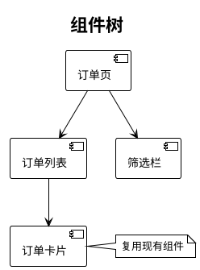

<!--
前端设计模板 —— 通用基座。画像含 web-frontend 时使用。
[标签] 章节按 references/profiles.md 裁剪；未启用则整段删除。
-->

# 前端设计文档

> 需求名称：{{name}}
> 日期：{{date}}
> 状态：待评审
> 关联：{{clarify_path}}
> 项目画像：{{profile}} ｜ 启用章节：{{tags}}

---

> **绘图约定**：本文档多图少文字。所有图用 PlantUML（` ```plantuml ` 内联），
> 图内用简洁自然语言短语描述，不放大段代码；每个图写完必须经 plantuml-lint
> 校验通过（见 references/design.md 绘图规范）。组件树用类图/组件图，
> 交互流程用时序图，状态流转用状态图。
> 节点命名用中文业务名(EnglishName)；单图 ≤ 8 节点，复杂流程拆子图；不用泳道。
> 按改动性质上色（只给本次相关逻辑上色）：黄 `#FFF9C4`=核心改动 ｜ 橙 `#FDEBD0`=一般修改 ｜ 绿 `#C8E6C9`=外部/接口调用 ｜ 白=历史逻辑。

## 〇、需求描述

{{一句话价值 + 要解决的问题 + 范围边界}}

## 一、页面与路由

| 页面/视图 | 路由 | 变更形式(新增/改) | 说明 |
| --- | --- | --- | --- |
|  |  |  |  |

## 二、组件拆分

> 用 PlantUML 组件图/类图画组件树，标注新增/复用/改造。复杂交互给出状态流转图。示例：



| 组件 | 职责 | 新增/复用 | 依赖 |
| --- | --- | --- | --- |
|  |  |  |  |

## 三、状态管理

- 状态放哪里（本地/全局 store/URL/服务端）、数据流向、缓存与失效策略。

## 四、接口契约

> 与后端约定的接口。字段、必填、默认值、错误结构。

| 接口 | 用途 | 请求/响应关键字段 | 错误处理 |
| --- | --- | --- | --- |
|  |  |  |  |

## 五、兼容性 `[frontend-compat]`

| 检查项 | 方案 |
| --- | --- |
| 目标浏览器/端范围 |  |
| 降级/polyfill 策略 |  |
| 存量用户兼容（缓存、旧版本客户端） |  |
| 响应式/多端适配 |  |

## 六、埋点与监控 `[frontend-compat]`

| 埋点/监控项 | 触发时机 | 上报字段 |
| --- | --- | --- |
|  |  |  |

- 前端错误监控（如 Sentry 类）、关键路径转化埋点。

## 七、性能预算

| 指标 | 目标 | 手段 |
| --- | --- | --- |
| 首屏/LCP |  | 代码分割 / 懒加载 / 预取 |
| 包体积 |  |  |
| 交互延迟/INP |  |  |

## 八、灰度与回滚

| 检查项 | 方案 |
| --- | --- |
| 灰度策略（按用户/百分比/开关） |  |
| 回滚方案 |  |
| 与后端联动的兼容窗口 |  |

## 九、引用梳理

| 类型 | 分析结果 |
| --- | --- |
| 复用的组件/hooks |  |
| 依赖的接口 |  |
| 共享状态/store |  |
| 路由影响 |  |

## 十、风险与权衡

> 显式列出已知风险、关键权衡（选了什么、牺牲了什么）、遗留问题。评审据此判断设计代价是否可接受，而不是只看"做了什么"。

| # | 类型(风险/权衡/遗留) | 描述 | 影响面 | 应对/缓解 |
| --- | --- | --- | --- | --- |
|  |  |  |  |  |

## 十一、验收标准回链

> 回链澄清阶段（`01-prd`）的验收标准，逐条标注由本设计的哪部分满足，确保设计不遗漏需求。

| # | 验收标准（来自澄清） | 满足它的设计章节/机制 | 覆盖程度 |
| --- | --- | --- | --- |
|  |  |  | 完全 / 部分 / 未覆盖 |

> 出现"部分/未覆盖" → 设计有缺口，补齐后再进入评审。
