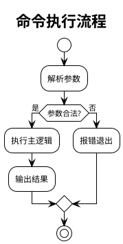

<!--
通用设计模板 —— CLI / 库 / 工具 / 开源项目使用。
最精简的基座；[标签] 章节按需保留。
-->

# 设计文档

> 需求名称：{{name}}
> 日期：{{date}}
> 状态：待评审
> 关联：{{clarify_path}}
> 项目画像：{{profile}} ｜ 启用章节：{{tags}}

---

> **绘图约定**：本文档多图少文字。所有图用 PlantUML（` ```plantuml ` 内联），
> 图内用简洁自然语言短语描述，不放大段代码；每个图写完必须经 plantuml-lint
> 校验通过（见 references/design.md 绘图规范）。
> 节点命名用中文业务名(EnglishName)；单图 ≤ 8 节点，复杂流程拆子图；不用泳道。
> 按改动性质上色（只给本次相关逻辑上色）：黄 `#FFF9C4`=核心改动 ｜ 橙 `#FDEBD0`=一般修改 ｜ 绿 `#C8E6C9`=外部/接口调用 ｜ 白=历史逻辑。

## 〇、需求描述

{{一句话价值 + 要解决的问题 + 范围边界}}

## 一、模块划分

> 新增/改造哪些模块，职责边界，模块间依赖方向。

| 模块 | 职责 | 新增/改造 | 依赖 |
| --- | --- | --- | --- |
|  |  |  |  |

## 二、公共 API / 接口契约

> 对外暴露的函数/命令/接口签名。这是兼容性的关键面。

| API / 命令 | 签名 | 用途 | 变更形式 | 兼容性 |
| --- | --- | --- | --- | --- |
|  |  |  |  |  |

## 三、数据结构

> 核心数据结构 / 配置 schema / 持久化格式。

| 结构 | 说明 | 变更形式 |
| --- | --- | --- |
|  |  |  |

## 四、核心流程

> 关键流程用 PlantUML 活动图表达步骤与分支。示例：



## 五、错误处理

| 错误场景 | 处理方式 | 对外表现（退出码/异常/日志） |
| --- | --- | --- |
|  |  |  |

## 六、兼容性

| 检查项 | 结论 |
| --- | --- |
| 是否破坏公共 API |  |
| 配置/数据格式向后兼容 |  |
| 依赖版本要求变化 |  |
| 弃用项与迁移路径 |  |

## 七、数据/存储 `[db]`

> 若涉及数据库/文件存储才保留。

| 存储对象 | 结构 | 迁移 | 引用 |
| --- | --- | --- | --- |
|  |  |  |  |

## 八、发布方式

| 项 | 说明 |
| --- | --- |
| 分发渠道（PyPI/npm/crates/二进制等） |  |
| 版本策略（语义化版本） |  |
| 回滚/撤版方案 |  |

## 九、引用梳理

| 类型 | 分析结果（谁在用、改了影响谁） |
| --- | --- |
| 公共 API 调用方 |  |
| 依赖模块 |  |
| 配置/数据格式使用方 |  |

## 十、风险与权衡

> 显式列出已知风险、关键权衡（选了什么、牺牲了什么）、遗留问题。评审据此判断设计代价是否可接受，而不是只看"做了什么"。

| # | 类型(风险/权衡/遗留) | 描述 | 影响面 | 应对/缓解 |
| --- | --- | --- | --- | --- |
|  |  |  |  |  |

## 十一、验收标准回链

> 回链澄清阶段（`01-prd`）的验收标准，逐条标注由本设计的哪部分满足，确保设计不遗漏需求。

| # | 验收标准（来自澄清） | 满足它的设计章节/机制 | 覆盖程度 |
| --- | --- | --- | --- |
|  |  |  | 完全 / 部分 / 未覆盖 |

> 出现"部分/未覆盖" → 设计有缺口，补齐后再进入评审。
